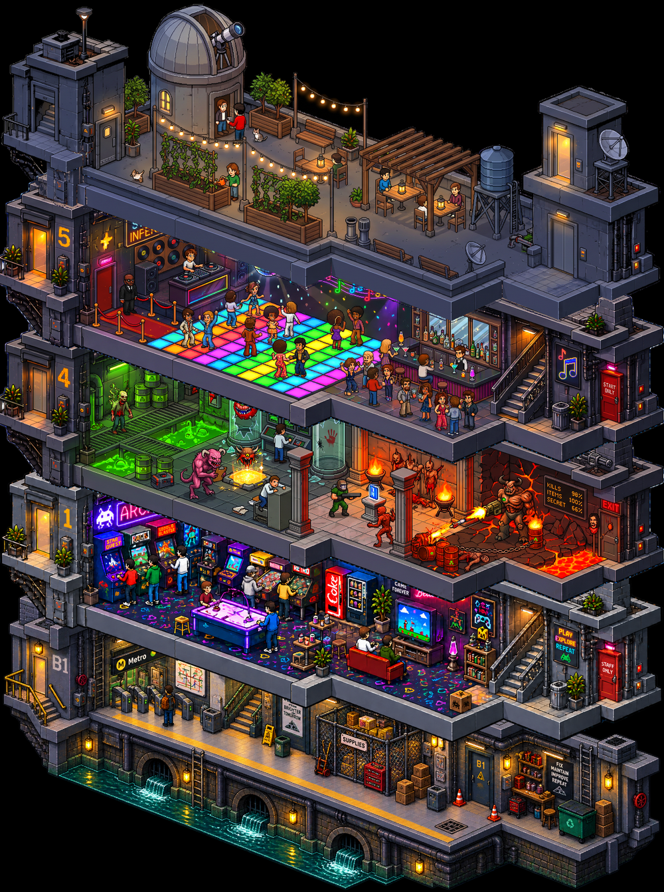

# nextfloor

eye candy mostly. useless mainly.

**[See it running →](https://nextfloor.up.railway.app)**

Bring your own Anthropic and fal keys to add a floor; looking costs nothing.



A generated isometric pixel-art building that grows one floor at a time. Type a
theme, and an AI pipeline draws a floor in that theme and stacks it on the tower.

The experiment: can independently generated floor tiles hold a rigid enough
visual contract that dozens of them still read as one continuous building?

## How a floor is made

1. **Theme Interpreter** (Claude) turns a theme into a structured floor spec.
2. **Art Director** (`src/lib/building/prompt.ts`, plain code) composes that spec
   with the immutable Building Style Guide into one image prompt.
3. **Image generation** (fal, Nano Banana) draws the tile from that prompt. Later
   floors are generated as an *edit* of the reference tile, which holds the shell
   far better than conditioning on it. FLUX was tried first and reads the
   structural prompt as a brief for an architectural render — it returns clean,
   empty, photoreal CAD cutaways.
4. **Validation** checks the tile against the contract and retries once.
5. A refusal or a second failure becomes a **dead floor** — a burnt-out storey
   rendered in CSS, with the reason on it.

The prompts live in `src/lib/prompts/` as markdown, not in code, because they are
what gets tuned every session:

- `iso-instructions.md` — the seed tile, which has nothing to match.
- `edit-instructions.md` — every later floor, generated as an edit of the
  reference tile. The reference carries the contract, so this prompt's job is to
  forbid changing it.
- `structure-{floor,roof,basement}.md` — the per-kind structural language.

`GET /api/prompt?mode=seed|edit` renders exactly what would be sent, so the
prompt can be read without spending a generation. `src/lib/building/styleGuide.ts`
holds the tile geometry. Changing any of it invalidates the visual compatibility
of every floor generated before the change.

## Starting tiles

`docs/reference/building-spec-sheet.png` is the drawn contract: 2048 x 512, 4:1,
identical shell on every floor, regular floors open top and bottom, roof closed
at the top, basement closed at the bottom.

`public/top-floor.png`, `public/middle-floor.png` and `public/bottom-floor.png`
are the static building: roof, reference floor, basement. Seeding imports them
instead of generating, and every generated floor is an edit of the middle one.
They must share one frame — the import refuses tiles that disagree.

Tiles are transparent PNGs composited over the black page. If a generator bakes
the transparency checkerboard in as opaque grey squares, restore real alpha with:

```bash
node scripts/dealpha.mjs public/bottom-floor.png
```

`TILE.pitchRatio` in `src/lib/building/styleGuide.ts` is the vertical repeat as a
fraction of tile height. It is well below 1 because an isometric frame is much
taller than one storey — it also contains the depth receding from the viewer, so
stacking tiles a full frame apart leaves a large gap.

## Running it

```bash
pnpm install
cp .env.example .env.local   # set DATABASE_URL
pnpm dev
```

Keys are bring-your-own: visitors enter an Anthropic key and a fal key in the
browser, and they are sent per request and never stored server-side. Set
`ALLOW_SERVER_KEYS=true` to let the server fall back to its own keys — leave it
off on a public deployment.

Tiles are stored in Postgres by default. Set `S3_BUCKET` (and install
`@aws-sdk/client-s3`) to use an S3-compatible bucket instead.

## Controls

Drag to pan, wheel to pan, cmd/ctrl-wheel to zoom at the cursor. The gutter on
the left labels each floor and holds its delete button. Floor 1 is the reference
tile and cannot be deleted.

## Deploying

The Railway service is connected to `main`: merging deploys. The database is
shared, so floors added locally already exist in production and appear as soon
as the code catches up.

`ALLOW_SERVER_KEYS` is off in production, so visitors bring their own Anthropic
and fal keys.

## Conventions

Layout, naming, styling, docs and the issue workflow follow
[project-standard](https://github.com/joshcoolman/project-standard). Where this
repo diverges, the divergence is an open issue rather than a local rule.

## Status

**Last shipped**

- The reference tile is no longer a storey. It is parked out of the numbering,
  so floor 1 is a slot like any other and the ground floor can be generated.
- Transparency veins repaired in the static tiles, and the prompt now asks for a
  `#222` outline on pure black -- a pure black outline is the same colour as the
  background to the alpha key, which is what hollowed the lines out.
- The projection angle is stated in the prompt: 1:2.76, about 20 degrees. Floors
  drifted to textbook 2:1 isometric whenever the model stopped copying, and
  "keep the camera angle" cannot correct a default it does not name.
- Tiles encode as lossless WebP at ingest, verified pixel-identical. The live
  building went 116 MB to 52 MB; `scripts/optimize-stored-tiles.mjs` is the
  catch-up for anything generated earlier.
- The basement is redrawn from a 2K generation and fitted to the frame.
- Elevator panel: call buttons in building order, the floor you are looking at
  lit, gaps drawn as dead sockets. Click a floor to lift the one above it.

**Up next**

The `now` label carries what to do next; `focus` is what is actively being
worked out. Issue #1 remains the overall spec.

Known gaps, in order of how much they cost:

- At 100% zoom the tower renders generated floors at 60.9%, and nearest-neighbour
  resampling breaks the art up. #23 has the measurements and three ways out.
- Floors 13, 14 and 15 were drawn before the projection angle was specified and
  meet their neighbours at the wrong angle. Measurable, not repairable short of
  regenerating them.
- The light fringe around each tile's outer silhouette. Same root cause as the
  veins; #42 would remove the need for the fix rather than make it.

**Focus**

Nothing is mid-flight. Generation is healthy -- seventeen floors, consistent
shells, few failures. Open #35 and start the house-cleaning pass; it names the
order and the reason for it.
